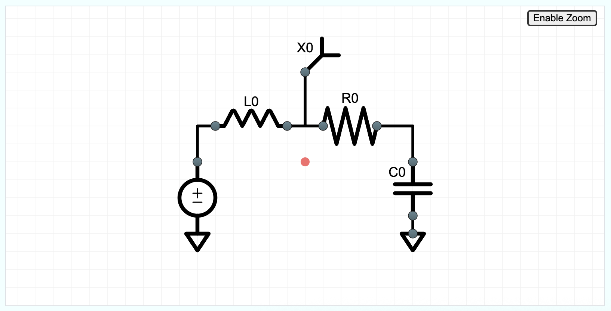

# visiojs

An embeddable javascript library with 1% of Microsoft Visio's features! For building flow charts and circuits in the browser.

### See it live here
[Codepen](https://codepen.io/28raining/pen/myJYavL)

[Online Circuit Solver](https://onlinecircuitsolver.com/)

## Features
- Touch-friendly interactions
- JSON state for easy undo/redo/save/manipulation
- Works in simple vanilla JS or React projects
- Full visual control via CSS classes (override `visiojs.css`)
- Strict grid snapping (hide the grid via CSS; choose your step size)
- Lightweight (~100KB gzipped, including d3)

### Supported environments
- Browsers: modern evergreen browsers
- Frameworks: vanilla JS, React (see examples)
- Delivery: npm (ES modules/CommonJS) and CDN (ESM/UMD)

## Where to start
- Getting Started: [View]({{ "/getting-started/" | relative_url }})
- Usage guide: [View]({{ "/usage/" | relative_url }})
- VisioJS state description: [View]({{ "/state/" | relative_url }})
- Examples:
  - React example: https://github.com/28raining/visiojs/tree/main/examples/circuit_react
  - Vanilla example: https://github.com/28raining/visiojs/tree/main/examples/circuit_vanilla